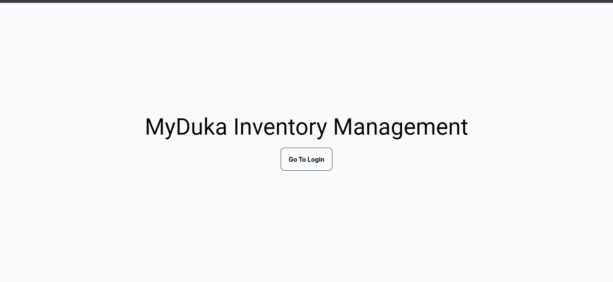
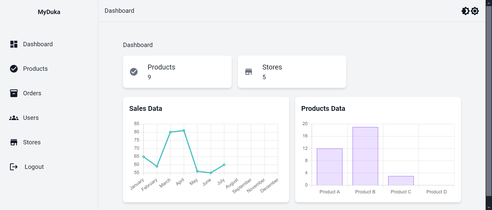

# MyDuka Inventory Management Application

This project is a minimal Web Application built to help with the stock taking and record keeping aspects of a small business.

## Table of Contents

-   [Project Overview](#project-overview)
-   [Features](#features)
-   [Installation](#installation)
-   [Usage](#usage)
-   [Contributing](#contributing)
-   [License](#license)

## Project Overview

Inventory management is an integral part of any business and this application aims to help ease the receiving and dispatching of stock in an environment that makes and keeps detailed records of that process. It is built with the business and the application's users in mind. This means that it is very simple and straightforward to use.

## Features

-   Secure login and authentication.
-   Detailed information about the products received and how they are managed and utilised during their lifespan in the business.
-   Capability to dispatch products to different stores in case a business has multiple outlets.

## Installation

If you are keen on cloning a copy of this project, you can do so at this [URL](https://github.com/Moringa-SDF-PTO5/myduka-group-5.git)

Here are the instructions on how to get your version up and running.

### Backend (Flask API)

The backend is currently hosted as a Render Web Service on this [link](https://myduka-api.onrender.com).

#### Prerequisites:

You will need to have the following installed in your machine to be able to run this application.

-   Postgresql - version 14 and above.
-   Python3 - version 3.8 and above.
-   Pipenv

The backend is built using **Flask**, a **Postgresql** database and **Flask SQLAlchemy** to manage the requirements from the database.

Python runs using **Pipenv** to manage the virtual environment.

A _requirements.txt_ file that shows all the project dependencies is available as well.

The backend code is hosted in the _server_ folder in the root directory of this project. A Pipfile with the dependencies is present. Change into the server folder, install the dependencies and activate your virtual environment using:

```bash
cd server
pipenv install
pipenv shell
```

Once all your dependencies are installed, you should create a (_.env_) file inside the server folder where you will host your environment variables. The names of these environment variables should match those in the \_server/app/\_\_init.py\_\_\_ file.

Create and name a database that you want to use for this project in your Postgresql environmnent. This will help you generate a connection string for use in the application.

The DATABASE_URL variable value should be the connection string to your local database. This is where your tables will be created.

Once this is set up, while still in the server folder, run the following command to start the backend part of the application and create all the tables that are needed.

```bash
python3 run.py
```

You can confirm the creation of the tables in your _psql_ shell on a terminal of your choosing.
After they are successfully created, run the following command to help seed your database with the initial dummy data that will get you engaging with the application without too much hassle.

```bash
python3 seed.py
```

### Frontend (React with Vite)

The frontend of this application is hosted in the _client_ folder in the root directory of this repository.

To be able to work with the frontend, change into the client folder and install the dependencies responsible for the frontend functionalities using the following commands:

```bash
cd client
npm install
```

**NOTE:**
While in development mode, as you are working with your local database, you will need to make some changes in the codebase so that the frontend can point/proxy to your local database.

Use the following instructions to achieve this:

1. The application uses Redux for state management. The queries are currently being made to the deployed database. You will need to edit the links present in the _features/*/*Slice_ files. These files have a URL variable at the top of the codebase. Remove the protocol and domain parts of the URL variable and leave only the path.

2. Create a (_.env.local_) file in the client root folder and add an environment variable with the following name - VITE*API_BASE_URL. The value of this variable should be the protocol and domain of your backend which should be \_http://127.0.0.1:5000* This is because you are currently working with your locally hosted backend.

3. The proxy setup for the development environment is already added in the _vite.config.js_ file in the root of the client folder.

Setting this up will allow your requests from the frontend to be made to the correct database and reflect correctly on the application.

Once all the steps above are complete, you can run the following command in your terminal to start the application.

```bash
npm run dev
```

This command will take you to the homepage of the application that looks like this.



On successful login, you will be directed to the dashboard that looks like this. This dashboard allows you access to the rest of the application and its various functionalities.



The deployed frontend is hosted [here](https://myduka-inventory-manager.onrender.com).

## Contributing

The team that is working on this project is still actively making changes and improvements to it. This means that it is currently not open for contribution. Once the team is satisfied with the work they have done, we will update our contribution policies to accept amazing ideas from you. **Keep checking back to see when this status changes**.

## License

MIT License

Copyright (c) [2024]

Permission is hereby granted, free of charge, to any person obtaining a copy
of this software and associated documentation files (the "Software"), to deal
in the Software without restriction, including without limitation the rights
to use, copy, modify, merge, publish, distribute, sublicense, and/or sell
copies of the Software, and to permit persons to whom the Software is
furnished to do so, subject to the following conditions:

The above copyright notice and this permission notice shall be included in all
copies or substantial portions of the Software.

THE SOFTWARE IS PROVIDED "AS IS", WITHOUT WARRANTY OF ANY KIND, EXPRESS OR
IMPLIED, INCLUDING BUT NOT LIMITED TO THE WARRANTIES OF MERCHANTABILITY,
FITNESS FOR A PARTICULAR PURPOSE AND NONINFRINGEMENT. IN NO EVENT SHALL THE
AUTHORS OR COPYRIGHT HOLDERS BE LIABLE FOR ANY CLAIM, DAMAGES OR OTHER
LIABILITY, WHETHER IN AN ACTION OF CONTRACT, TORT OR OTHERWISE, ARISING FROM,
OUT OF OR IN CONNECTION WITH THE SOFTWARE OR THE USE OR OTHER DEALINGS IN THE
SOFTWARE.

## Authors

-   Winnie Abuor - Backend
-   Josephine Mueni - Backend
-   Saiyalel Kantai - Backend
-   Frasia Kemunto - Frontend
-   Barbara Tess - Frontend
